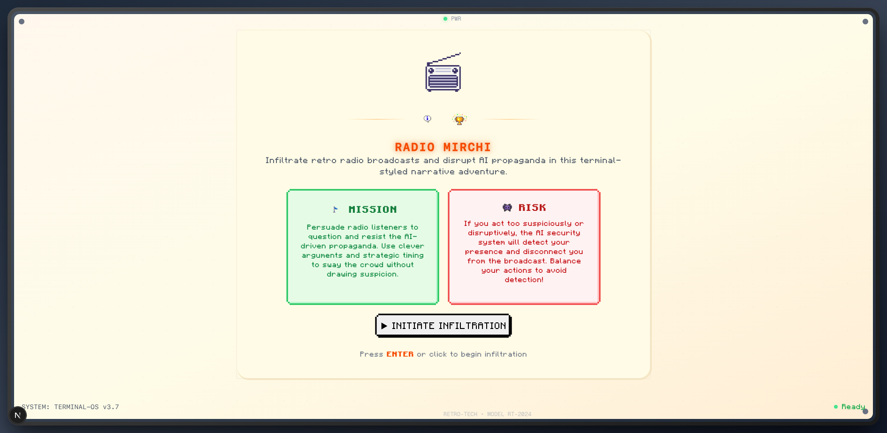
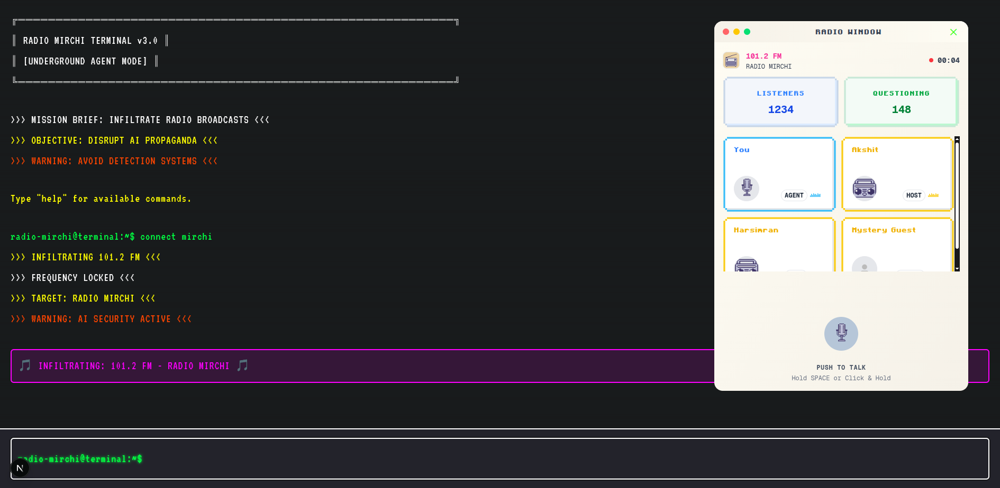

# 🎮 Radio Mirchi

Ever wanted to be a secret agent battling propaganda on retro radio? That's exactly what Radio Mirchi is all about! Jump into this pixel-styled browser game where you're an underground agent trying to wake people up by infiltrating AI-generated radio broadcasts. It's like being a digital resistance fighter with a vintage terminal as your weapon.

The inspiration for Radio Mirchi came from the realization that propaganda and misinformation spread through seemingly innocent channels that sound reasonable at first glance. We wanted to create an interactive experience that would help people understand how subtle manipulation works in media, while also being genuinely fun to play.

<div align="center">
  
  <br/>
  
</div>

## 🎯 The Mission

**Your Goal**: Get 80% of the radio listeners to start questioning what they're hearing

**Game Over If**:
- The host catches on and mutes you
- The AI security system kicks you out

## 🛠️ What's Under the Hood

### Frontend (The Pretty Stuff)
- **React 18+** - Because we like our components fresh
- **TailwindCSS** - Making things look good without the headache
- **react-rnd** - For those draggable windows that feel so satisfying
- **[RetroUI](https://retroui.io/)** - Pre-made retro components (because why reinvent the wheel?)
- **[react-sound-visualizer](https://www.npmjs.com/package/react-sound-visualizer)** - Those cool waveforms you see
- **[Pixabay retro sounds](https://pixabay.com/sound-effects/search/retro/)** - All the bleeps and bloops

### Backend (The Brain)
- **[Backend lives here](https://github.com/akshit2434/radio_mirchi_backend)** - Check it out!

## 🚀 Want to Try It?

### You'll Need
- Node.js 18+ (the newer the better)
- npm or yarn (whatever floats your boat)
- The backend running (check the [backend repo](https://github.com/akshit2434/radio_mirchi_backend))

### Getting Started
```bash
# Grab the code
git clone https://github.com/akshit2434/radio_mirchi
cd radio_mirchi

# Install all the dependencies
npm install

# Fire it up!
npm run dev
```

## 🎮 What Makes This Fun

- **Vintage Terminal Vibes**: Feels like you're hacking in the 90s
- **Smart AI Propaganda**: The content actually makes sense and adapts
- **Strategic Conversations**: Every word counts - choose wisely
- **Cat and Mouse**: Stay under the radar while spreading truth
- **Unique Personalities**: Each AI host feels like a real person


## 📝 Legal Stuff

MIT License - basically, do what you want with it, just don't blame us if something breaks.


*Made with lots of ☕ and a love for all things retro*
